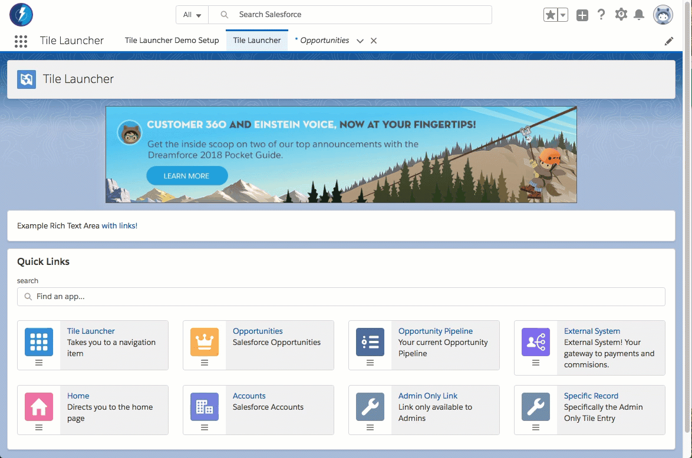
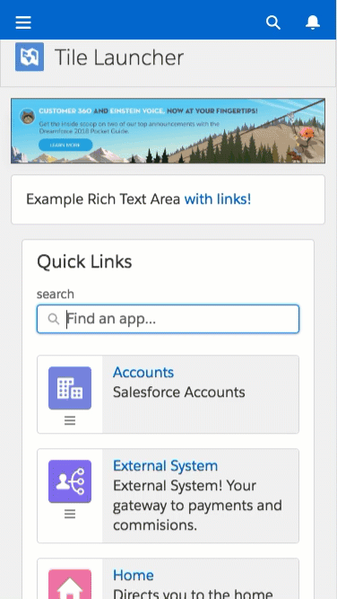
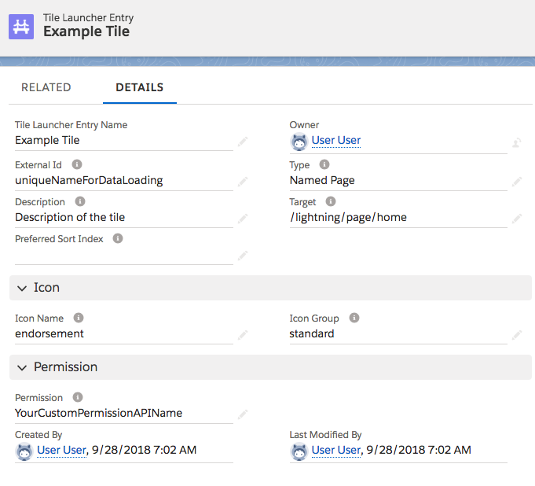
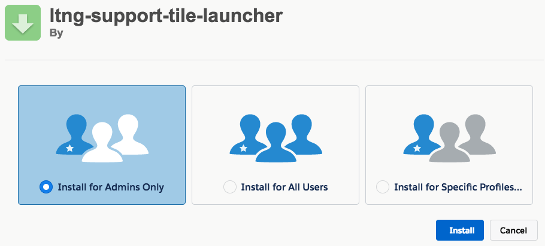
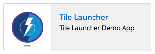
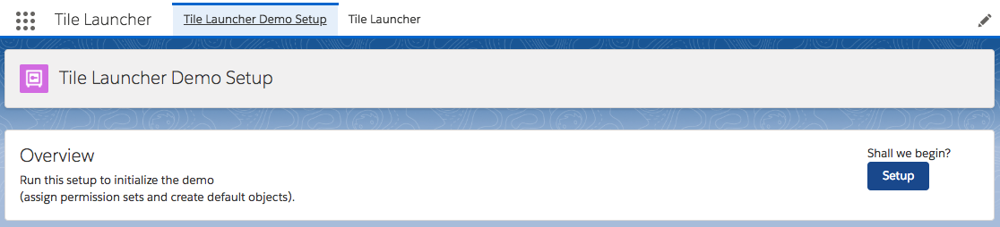

# Overview

Please see the [Installation](#install) section below for more on how to install on your Sandbox / Demo org.

**Please note: sample code (metadata api and dx formats) are is also available in the [mdapi](./mdapi) and [dx](./dx) folders above**

---

Have your end users ever needed to provide a customizable launchpad within Salesforce (Lightning Experience or Mobile)?

We've provided two specific components: the 'Tile Launcher' and 'Hero Button' components to provide a secured way for your end users to start their day.

They can navigate to other apps, other areas within salesforce choosing from a user sortable list of tiles - all as a one stop launching pad.

[Customizable](docs/images/ExampleTile.png) with [any choice of standard icons](https://www.lightningdesignsystem.com/icons/), [secured by custom permissions](docs/images/securedByCustomPermission.jpg) and [navigatable to internal or external areas](https://developer.salesforce.com/docs/atlas.en-us.lightning.meta/lightning/components_navigation_page_definitions.htm).

Or Administrators can easily highlight upcoming activities or events - using a customizable Hero Button that can navigate them to other pages or external apps. 

# TLDR How

## Tile Launcher

**1.** Assign either of the following permission sets:

* Tile Launcher Demo Admin - someone that can administer the Tile Launcher
* Tile Launcher Demo Participant - someone that can see the Tile Launcher

(the base permissions are: access to the Tile Launcher app builder page, and read access to the Tile Launcher Entry objects)

**2.** Access the Tile Launcher from the 'App Launcher' dice

Either from the Desktop:

Or from Mobile:

### Adding a new Tile:

**1.** As an administrator (or someone with the `Tile Launcher Demo Admin` permission set), Navigate to the list of `Tile Launcher Entries`

<table>
	<tr>
		<th>What to enter</th><th>Description</th><th>Example</th>
	</tr>
	<tr>
		<td>Tile Launcher Entry Name</td>
		<td>Not shown to users, but human name to find this tile</td>
		<td>Example Tile</td>
	</tr>
	<tr>
		<td>External Id</td>
		<td>Not shown to end users, but used for simpler data loads</td>
		<td>uniqueNameUsedWhenLoading</td>
	</tr>
	<tr>
		<td>Description</td>
		<td>Description shown to the end user - next to the icon</td>
		<td>Your gateway to wonders!</td>
	</tr>
	<tr>
		<td>Type</td>
		<td>The type of target we reference. <a href='#types-of-targets'>More below</a></td>
		<td>URL or Named Page</td>
	</tr>
	<tr>
		<td>Target</td>
		<td>The url to navigate to. (We recommend removing the domain)</td>
		<td>Recommended: /lightning/page/home  
		although https://your-domain.my.salesforce.com/lightning/page/home works too</td>
	</tr>
	<tr>
		<td>Icon Name</td>
		<td>One of the names from <a href='https://lightningdesignsystem.com/icons'>the lightning design sytem</a></td>
		<td>account, entitlement_process or environment_hub</td>
	</tr>
	<tr>
		<td>Icon Group</td>
		<td>The group the icon belongs to (the header in the list)</td>
		<td>Standard Icons means 'standard', Custom Icons means 'custom'</td>
	</tr>
	<tr>
		<td>Permission</td>
		<td>The API name of the custom permission required to see this tile. Blank if anyone can see it.</td>
		<td>YourCustomPermissionAPIName</td>
	</tr>
</table>

### Types of Targets

* URL - any external system - uses [NavigateToURL](https://developer.salesforce.com/docs/component-library/bundle/force:navigateToURL/documentation)
* Knowledge Article - reference a knowledge article
* Named Page - access: 'home', 'chatter', 'today' 
* Navigation Item - Custom Tab 
* Object Page - Recent or list views for an object 
* Record Page - Directly access a record 
* Record Relationship Page - Related List

All except URL use the Lightning:Navigation component to navigate to different areas of the app based on the [PageReference patterns](https://developer.salesforce.com/docs/atlas.en-us.lightning.meta/lightning/components_navigation_page_definitions.htm). [See Here for more on what those types mean](https://developer.salesforce.com/docs/atlas.en-us.lightning.meta/lightning/components_navigation_page_definitions.htm)

Although the Type isn't as important yet (it finds the first match based on Priority of the Custom Metadata records), it is important to align as best as possible for the day that it is necessary.

## Hero Button

Simply drag and drop the Hero Button within the App Builder to use.
(The App Builder is found under Setup)

It will be available to users that see that page.

---

# Install

There are three methods available for you to install this demo, so you can play around with it:

(Please note, all are intended as demonstrations and are not intended for deployment to Production as is)

* [Install via URL](#install-via-url)
* [Install Demo via Salesforce CLI](#install-via-salesforce-cli)
* [Install Demo via Ant/Metadata API](#install-via-metadata-api)

## Install via URL

This works very similar to an App Exchange install.

Please login to an available sandbox and click the link below.

[https://test.salesforce.com/packaging/installPackage.apexp?p0=04t6A0000038GJyQAM](https://test.salesforce.com/packaging/installPackage.apexp?p0=04t6A0000038GJyQAM)

(or simply navigate to `https://YOUR_SALESFORCE_INSTANCE/packaging/installPackage.apexp?p0=04t6A0000038GJyQAM`  
if you are already logged in)

It is recommended to install for Admins Only (but all options will work)

##### Run Demo Setup

Next, click on the 'dice' and open the 'URL Hack Demo' app.

and run `Setup` from the `Demo Setup` tab.

This will then perform any additional setup (such as creating records, etc).

##### Run the Demos

Thats it. See the [How to Use](#tldr-how) section for how to use the app.

## Installing via the Salesforce CLI

This assumes you have already installed the [Salesforce CLI]() and [Connected the Salesforce CLI to your org](https://developer.salesforce.com/docs/atlas.en-us.sfdx_dev.meta/sfdx_dev/sfdx_dev_auth_web_flow.htm).

However, the Salesforce CLI can be used with any org and does not require Salesforce DX to be enabled. (Although enabling the DX / Dev Hub would give some great benefits, and would only require care of [certain object permissions: Scratch Org Info, ActiveScratchOrg, NamespaceRegistry](https://developer.salesforce.com/docs/atlas.en-us.sfdx_setup.meta/sfdx_setup/sfdx_setup_add_users.htm) - as they are not available in all orgs)

**1.** Run the following command:

	sfdx force:mdapi:deploy -d mdapi -u [[orgAlias]] -w

**2.** Add the permission set to your user

	sfdx force:user:permset:assign -n TileLauncherDemoAdmin -u [[orgAlias]]
	
**3.** Open the Org and run the Tile Launcher Setup

Next, click on the 'dice' and open the 'URL Hack Demo' app.

and run `Setup` from the `Demo Setup` tab.

This will then perform any additional setup (such as creating records, etc).

##### Run the Demos

Thats it. See the [How to Use](#tldr-how) section for how to use the app.
