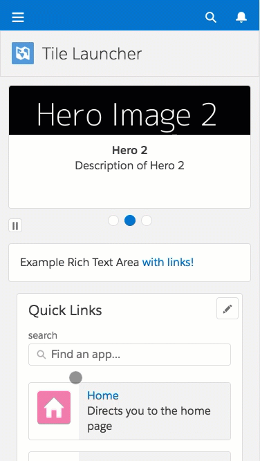
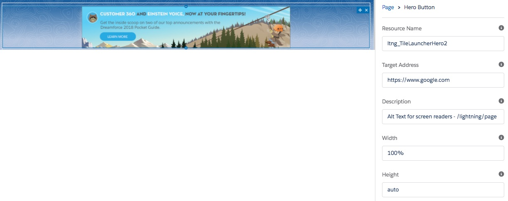
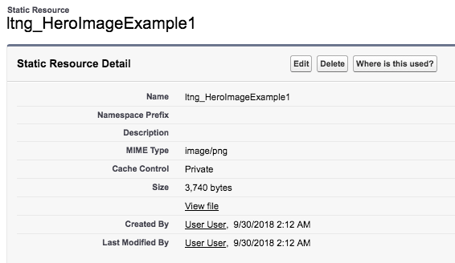

# Overview

Please see the [Installation](#install) section below for more on how to install on your Sandbox / Demo org.

**Please note: sample code (metadata api and dx formats) are is also available in the [mdapi](./mdapi) and [dx](./dx) folders above**

---

Have your end users ever needed to provide a customizable launchpad within Salesforce (Lightning Experience or Mobile)?

We've provided two specific components: the 'Tile Launcher' and 'Hero Button' components to provide a secured way for your end users to start their day.

They can navigate to other apps, other areas within salesforce choosing from a user sortable list of tiles - all as a one stop launching pad.

[Customizable](docs/images/ExampleTile.png) with [any choice of standard icons](https://www.lightningdesignsystem.com/icons/), [secured by custom permissions](docs/images/securedByCustomPermission.jpg) and [navigatable to internal or external areas](https://developer.salesforce.com/docs/atlas.en-us.lightning.meta/lightning/components_navigation_page_definitions.htm).

Or Administrators can easily highlight upcoming activities or events - using a customizable Hero Button that can navigate them to other pages or external apps. 

All in a way that is intuitive for where your users are.

# TLDR How

## Tile Launcher

**1.** Assign either of the following permission sets:

* Tile Launcher Demo Admin - someone that can administer the Tile Launcher
* Tile Launcher Demo Participant - someone that can see the Tile Launcher

(the base permissions are: access to the Tile Launcher app builder page, and read access to the Tile Launcher Entry objects)

**2.** Access the Tile Launcher from the 'App Launcher' dice

Either from the Desktop:

Or from Mobile:

### Adding a new Tile:

**1.** As an administrator (or someone with the `Tile Launcher Demo Admin` permission set), Navigate to the list of `Tile Launcher Entries`

<table>
	<tr>
		<th>What to enter</th><th>Description</th><th>Example</th>
	</tr>
	<tr>
		<td>Tile Launcher Entry Name</td>
		<td>Not shown to users, but human name to find this tile</td>
		<td>Example Tile</td>
	</tr>
	<tr>
		<td>External Id</td>
		<td>Not shown to end users, but used for simpler data loads</td>
		<td>uniqueNameUsedWhenLoading</td>
	</tr>
	<tr>
		<td>Description</td>
		<td>Description shown to the end user - next to the icon</td>
		<td>Your gateway to wonders!</td>
	</tr>
	<tr>
		<td>Type</td>
		<td>The type of target we reference. <a href='#types-of-targets'>More below</a></td>
		<td>URL or Named Page</td>
	</tr>
	<tr>
		<td>Target</td>
		<td>The url to navigate to. (We recommend removing the domain)</td>
		<td>Recommended: /lightning/page/home  
		although https://your-domain.my.salesforce.com/lightning/page/home works too</td>
	</tr>
	<tr>
		<td>Icon Name</td>
		<td>One of the names from <a href='https://lightningdesignsystem.com/icons'>the lightning design sytem</a></td>
		<td>account, entitlement_process or environment_hub</td>
	</tr>
	<tr>
		<td>Icon Group</td>
		<td>The group the icon belongs to (the header in the list)</td>
		<td>Standard Icons means 'standard', Custom Icons means 'custom'</td>
	</tr>
	<tr>
		<td>Permission</td>
		<td>The API name of the custom permission required to see this tile. Blank if anyone can see it.</td>
		<td>YourCustomPermissionAPIName</td>
	</tr>
</table>

## Hero Button

A Hero Image (often known as a banner) provides a simple way to convey a message to an audience, and a call-to-action as it navigates them where they can learn more.

### To configure:

Simply drag and drop the Hero Button within the App Builder to use.
(The App Builder is found under Setup)

It will be available to users that see that page.

(To use your own banner images, please see the [Static Resource Hero Images section](#static-resource-banner-images) below)

<table>
	<tr>
		<th>What to enter</th><th>Description</th><th>Example</th>
	</tr>
	<tr>
		<td>Resource Name</td>
		<td>API Name of the image Static Resource to show. <a href='#static-resource-banner-images'>See Below</a> for uploading your own banner images.</td>
		<td>MyExampleHeroImage</td>
	</tr>
	<tr>
		<td>Target Address</td>
		<td>URL Address to direct users when they click the Hero Image</td>
		<td>https://www.salesforce.com</td>
	</tr>
	<tr>
		<td>Description</td>
		<td>Alt Text to show for screen readers on the Hero Image.</td>
		<td>Earn more while on the go. Click here for more.</td>
	</tr>
	<tr>
		<td>Width</td>
		<td>CSS width of the image (either in pixels or percentage)</td>
		<td>100px OR 100% OR Auto</td>
	</tr>
	<tr>
		<td>Height</td>
		<td>CSS height of the image (either in pixels or percentage)</td>
		<td>100px OR 100% OR Auto</td>
	</tr>
</table>

## Hero Carousel

The Hero Carousel is an extended version of the Hero Button - to allow for a series of Calls-to-Action (instead of a single one).

### To see current Hero Notifications

The list of Hero Notification records are available by default within the Tile Launcher component, but can also be found by searching 'Hero Notifications' in the Lightning App Launcher (dice in the top left)

This list of custom objects let you define which Hero Notifications that users will see, and when.

### To Create a new Hero Notification

Simply click the edit or new button to create a new record.

<table>
	<tr>
		<th>What to enter</th><th>Description</th><th>Example</th>
	</tr>
	<tr>
		<td>Hero Notification Name</td>
		<td>Internal name for this record</td>
		<td>Example Hero 1</td>
	</tr>
	<tr>
		<td>External Id</td>
		<td><a href='https://help.salesforce.com/HTViewSolution?id=000002783'>External Ids</a> allow for simple data loading. Through Data Loader, or other tools</td>
		<td>ex_Hero1</td>
	</tr>
	<tr>
		<td>Resource Name</td>
		<td>API Name of the image Static Resource to show. <a href='#static-resource-banner-images'>See Below</a> for uploading your own banner images.</td>
		<td>MyExampleHeroImage</td>
	</tr>
	<tr>
		<td>Priority</td>
		<td>Images are shown based on decreasing priority.</td>
		<td>10</td>
	</tr>
	<tr>
		<td>Title</td>
		<td>If description is shown: the tile of the card</td>
		<td>Earn more commissions on the go</td>
	</tr>
	<tr>
		<td>Description</td>
		<td>If description is shown: the body of the card.</td>
		<td>Now you can earn more commissions with the Salesforce mobile app. Click here to learn more...</td>
	</tr>
	<tr>
		<td>Alternative Text</td>
		<td>Alternative text for the image - used with screen readers.</td>
		<td>Alt text for the hero image...</td>
	</tr>
	<tr>
		<td>URL</td>
		<td>Where to navigate the user when the click this hero image.</td>
		<td>https://www.salesforce.com</td>
	</tr>
	<tr>
		<td>Type</td>
		<td>The type of target we reference. <a href='#types-of-targets'>More below</a></td>
		<td>URL or Named Page</td>
	</tr>
	<tr>
		<td>Start Date</td>
		<td>Heros will only be shown after the start date (or immediately if no start date provided)</td>
		<td>1/1/2020 7:00 am</td>
	</tr>
	<tr>
		<td>End Date</td>
		<td>Heros will only be shown until the end date (or always shown if no end date provided).</td>
		<td>1/1/2024 7:00 am</td>
	</tr>
	<tr>
		<td></td>
		<td></td>
		<td>division1, division2, division4</td>
	</tr>
</table>

Note that the Hero Notification records have a unique External Id - intended to simplify data loading. 

### To Configure the component

Simply drag and drop the Hero Button within the App Builder to use.
(The App Builder is found under Setup)

It will be available to users that see that page.

(To use your own banner images, please see the [Static Resource Hero Images section](#static-resource-banner-images) below)

<table>
	<tr>
		<th>What to enter</th><th>Description</th><th>Example</th>
	</tr>
	<tr>
		<td>Allow AutoScroll</td>
		<td>Automatically switch between hero images (if there are multiple)</td>
		<td>true</td>
	</tr>
	<tr>
		<td>AutoScroll Slide Duration</td>
		<td>If AutoScroll enabled: # Seconds that each image is shown</td>
		<td>5</td>
	</tr>
	<tr>
		<td>Show Description</td>
		<td>Whether to show the text area underneath the image (true) or not (false)</td>
		<td>false</td>
	</tr>
</table>

## Static Resource Banner Images

[Static Resources](https://trailhead.salesforce.com/en/modules/visualforce_fundamentals/units/visualforce_static_resources) are a place to provide images in a way accessible to logic.

We use static resources to store/reference the images used in the Hero Images / Banners, so they can be leveraged within the Hero Button and Hero Carousel components.

### To see a list of Static Resources

To see a list of current Static Resource, search for 'Static Resource' in the Setup quickfinder.

Clicking on the Name (or API Name in this case) of the Static Resource will show the Static Resource Detail.

(This includes the API Name and a link to preview the file and size.  It also includes whom created the Static Resource, and any description)

### To Create a new Static Resource Banner Image

Click the 'New' button on the Static Resource list.

<table>
	<tr>
		<th>What to enter</th><th>Description</th><th>Example</th>
	</tr>
	<tr>
		<td>Name</td>
		<td>API Name of the image Static Resource to show. (Must be letters, numbers or underscores)</td>
		<td>MyExampleHeroImage</td>
	</tr>
	<tr>
		<td>Description</td>
		<td>Description of the resource (only available through API)</td>
		<td>Description of my Resource.</td>
	</tr>
	<tr>
		<td>File</td>
		<td>A file uploader to provide the image.</td>
		<td></td>
	</tr>
	<tr>
		<td>Cache Control</td>
		<td><a href='https://help.salesforce.com/articleView?id=pages_static_resources_create.htm&type=5'>Cache Control</a> indicates if the resource can be shared across users (Public) or per user (Private).</td>
		<td>Public</td>
	</tr>
</table>

Once the resource has been created, just copy the Name (or the API Name) - as this indicates the resource we will use.

## Types of Targets

* URL - any external system - uses [NavigateToURL](https://developer.salesforce.com/docs/component-library/bundle/force:navigateToURL/documentation)
* Knowledge Article - reference a knowledge article
* Named Page - access: 'home', 'chatter', 'today' 
* Navigation Item - Custom Tab 
* Object Page - Recent or list views for an object 
* Record Page - Directly access a record 
* Record Relationship Page - Related List

All except URL use the Lightning:Navigation component to navigate to different areas of the app based on the [PageReference patterns](https://developer.salesforce.com/docs/atlas.en-us.lightning.meta/lightning/components_navigation_page_definitions.htm). [See Here for more on what those types mean](https://developer.salesforce.com/docs/atlas.en-us.lightning.meta/lightning/components_navigation_page_definitions.htm)

Although the Type isn't as important yet (it finds the first match based on Priority of the Custom Metadata records), it is important to align as best as possible for the day that it is necessary.

## Custom Permission

[Custom Permissions](https://help.salesforce.com/articleView?id=custom_perms_overview.htm&type=5) are a configurable way to specify whom can access which type of feature.

We use Custom Permissions with the Hero Carousel to segment what types of Hero Notifications or Tiles that the user can see.

For more information on Custom Permissions, please see [Custom Permissions in the Salesforce Help](https://help.salesforce.com/articleView?id=custom_perms_overview.htm&type=5)

### Creating Custom Permissions

For example, say that we have users that need to Administer Hero Images and Tile Launcher Entries.

We can see the list of Custom Permissions by searching for `Custom Permission` within the Setup Quick find.

Here we can create a new Custom Permission that we we can assign to users, and enforce (at different areas) that only users with this Custom Permission can proceed.

(In our case, we simply specify using the Custom Permission API Name on either the Hero Notification record or Tile Launcher Entry record, and it takes care of hiding the tiles)

### Assigning Custom Permissions

Custom Permissions can be assigned out either:

* [Through Permission Set](https://help.salesforce.com/articleView?id=perm_sets_custom_perms.htm&type=5) or
* [Through Profile](https://help.salesforce.com/articleView?id=users_profiles_custom_perms.htm&type=5)

Both simply by selecting the Custom Permission from the list, and adding it to the list of enabled Custom Permissions.

---

# Install

There are three methods available for you to install this demo, so you can play around with it:

(Please note, all are intended as demonstrations and are not intended for deployment to Production as is)

* [Install via URL](#install-via-url)
* [Install Demo via Salesforce CLI](#install-via-salesforce-cli)
* [Install Demo via Ant/Metadata API](#install-via-metadata-api)

## Install via URL

This works very similar to an App Exchange install.

Please login to an available sandbox and click the link below.

[https://test.salesforce.com/packaging/installPackage.apexp?p0=04t6A0000038GXUQA2](https://test.salesforce.com/packaging/installPackage.apexp?p0=04t6A0000038GXUQA2)

(or simply navigate to `https://YOUR_SALESFORCE_INSTANCE/packaging/installPackage.apexp?p0=04t6A0000038GXUQA2`  
if you are already logged in)

It is recommended to install for Admins Only (but all options will work)

##### Run Demo Setup

Next, click on the 'dice' and open the 'URL Hack Demo' app.

and run `Setup` from the `Demo Setup` tab.

This will then perform any additional setup (such as creating records, etc).

##### Run the Demos

Thats it. See the [How to Use](#tldr-how) section for how to use the app.

## Installing via the Salesforce CLI

This assumes you have already installed the [Salesforce CLI]() and [Connected the Salesforce CLI to your org](https://developer.salesforce.com/docs/atlas.en-us.sfdx_dev.meta/sfdx_dev/sfdx_dev_auth_web_flow.htm).

However, the Salesforce CLI can be used with any org and does not require Salesforce DX to be enabled. (Although enabling the DX / Dev Hub would give some great benefits, and would only require care of [certain object permissions: Scratch Org Info, ActiveScratchOrg, NamespaceRegistry](https://developer.salesforce.com/docs/atlas.en-us.sfdx_setup.meta/sfdx_setup/sfdx_setup_add_users.htm) - as they are not available in all orgs)

**1.** Run the following command:

	sfdx force:mdapi:deploy -d mdapi -u [[orgAlias]] -w

**2.** Add the permission set to your user

	sfdx force:user:permset:assign -n TileLauncherDemoAdmin -u [[orgAlias]]
	
**3.** Open the Org and run the Tile Launcher Setup

Next, click on the 'dice' and open the 'URL Hack Demo' app.

and run `Setup` from the `Demo Setup` tab.

This will then perform any additional setup (such as creating records, etc).

##### Run the Demos

Thats it. See the [How to Use](#tldr-how) section for how to use the app.
